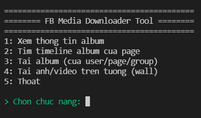
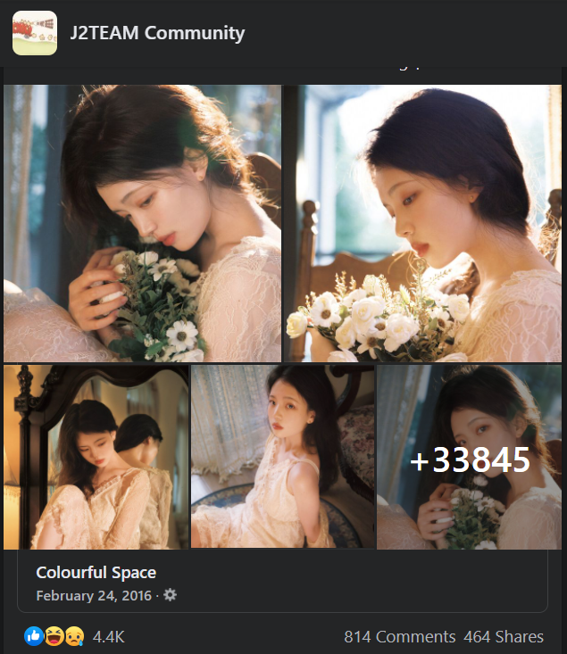
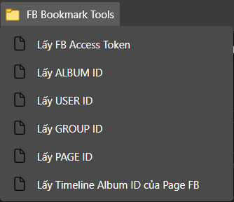
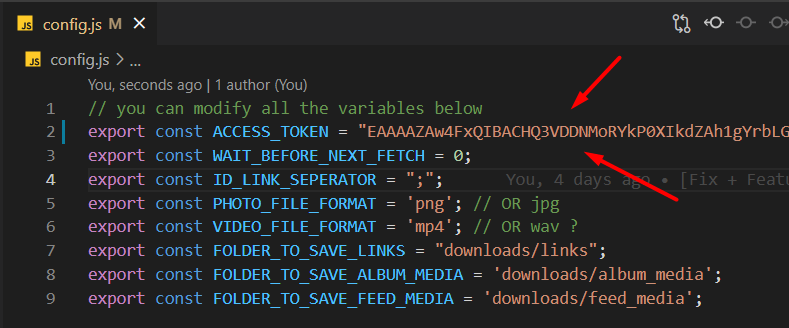
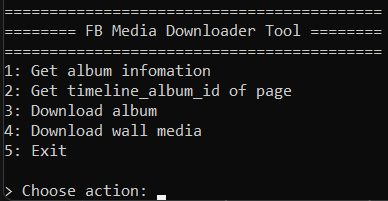
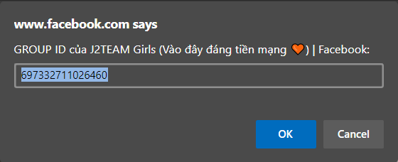
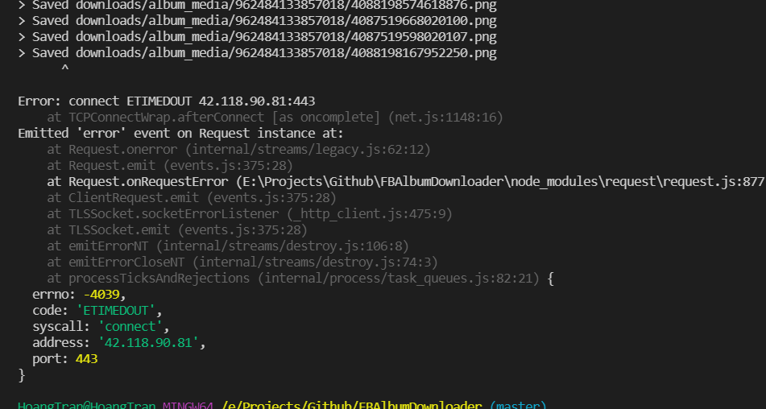
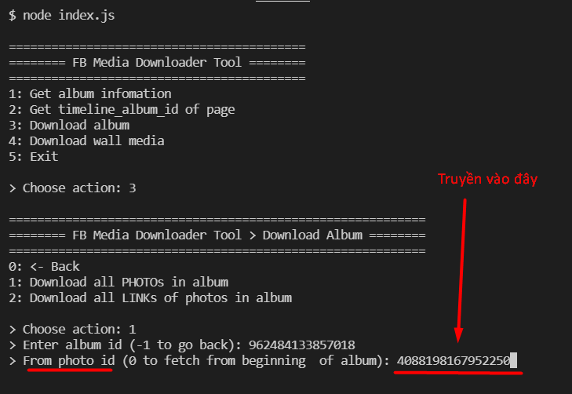
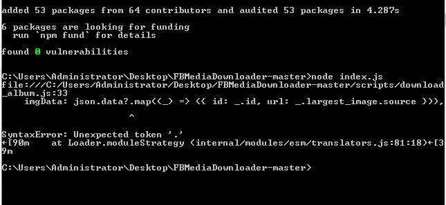

# FB Media Downloader

[Post FB](https://www.facebook.com/groups/j2team.community/posts/1665799000418880/) giới thiệu tool

[Video hướng dẫn](https://youtu.be/g4zh9p-QfAQ)

1 Tool nhỏ viết bằng Nodejs. Giúp:

- Tải nhanh 1 album ảnh bất kì trên facebook, bạn chỉ cần có id của album ảnh đó là được.

- **Update**(19/09/2021): Tool có thêm chức năng tải tất cả ảnh/video trên tường của 1 đối tượng (user/group/page)

- **Update**(21/09/2021):
  - Có thêm chức năng **tải album tại vị trí bất kỳ** (không nhất thiết là từ đầu album tới cuối album). Dành cho trường hợp bạn tải được 1 nửa album rồi mà bị rớt mạng hoặc lỗi. Thì chỉ cần mở lại rồi tải từ vị trí ảnh tải được gần nhất là xong.
  - Giao diện tiếng việt (không dấu)
  - 

## Ưu Điểm

### CÓ 4 CHỨC NĂNG CHÍNH

1. Xem **thông tin album** (tên, số lượng ảnh, link, ...)
2. **Tải timeline album** của 1 **page** fb: _đây là album ẩn, chứa tất cả ảnh từ trước tới giờ trong page fb đó. Ví dụ như hình phía trên ([link](https://www.facebook.com/groups/j2team.community/posts/1377217242610392/))_.
3. **Tải album bất kì**: _album của user, của group, hay của page đều chơi được tất_.
4. **Tải tất cả ảnh/video** trên **tường** (wall) của 1 đối tượng **(user/group/page)**.

Để có thể tải những thứ trên thì bạn chỉ cần truyền vào **album_id / user_id / group_id / page_id**. Để có thể **dễ dàng lấy** được những id này mình cũng đã viết sẵn các **bookmark scripts** cho các bạn sử dụng. Xem trong file [scripts/bookmarks.js](./scripts/bookmarks.js).

- 

### CÓ 2 CHẾ ĐỘ

- Bạn có thể tải **FILE**:
  - Tất cả **FILE ẢNH** trong album
  - Tất cả **FILE ẢNH/VIDEO** trên tường của đối tượng (user/group/page).
- Hoặc có thể tải **URL**:
  - Tất cả **ĐƯỜNG DẪN URL** của những ảnh/video trong album/trên tường.
  - Tool sẽ lưu danh sách url đó vào **1 file**. (Rồi sau này muốn làm gì đống link đó thì tùy bạn).

### TẢI CỰC NHANH

- Tại sao viết tool bằng **NodeJs** chứ không phải **chrome extension**, vì theo mình thấy những việc liên quan tới tải file vậy thì dùng NodeJs sẽ nhanh hơn rất nhiều so với extension (phải thông qua trình duyệt để tải file).
- Tốc độ tải file sẽ phụ thuộc vào đường truyền mạng của bạn. Có khi ngốn hết băng thông luôn đấy, MAX NHANH NHÉ.
- VÍ DỤ Tải [album 30 NGHÌN ảnh](https://www.facebook.com/media/set?vanity=ColourfulSpace&set=a.945632905514659) trong chưa đầy 15p (intel core i5, gen 8, 12GB RAM)

### TẢI CỰC NHIỀU

- Tool có thể tải và lưu cả **Timeline Album** - 1 dạng album ẨN, chứa TẤT CẢ các hình ảnh có trong 1 PAGE FACEBOOK. Ví dụ: [Post này](https://www.facebook.com/groups/j2team.community/posts/1377217242610392/) (Mình tải thử thì được 7GB ảnh)
- Tool có thể tải **TẤT CẢ ảnh/video trên wall** 1 đối tượng (user/group/page). Chẳng hạn bạn muốn tải hết ảnh/video từng được đăng lên [J2team Girl](https://www.facebook.com/groups/j2team.community.girls)? Chuyện đó giờ dễ như trở bàn tay!!

### KHÔNG BỊ CHECKPOINT

- Tool dùng acccess token của bạn để fetch dữ liệu từ Facebook (Các API mình tham khảo từ [Đây](https://developers.facebook.com/tools/explorer)).
- Việc Fetch dữ liệu thì không ảnh hưởng tới checkpoint nhé. Fetch sẽ trả về link ảnh/video.
- Việc tải ảnh/video từ link thì cũng không ảnh hưởng luôn.
- Mình đã thử ở album [Này](https://www.facebook.com/media/set?vanity=ColourfulSpace&set=a.945632905514659). Trên 30 NGHÌN ảnh, tải rất mượt và không vấn đề gì nhé.
- Nếu có vấn đề thật thì các bạn chỉ cần lấy access token khác là xong :))

### BOOKMARK HỖ TRỢ

Mình viết sẵn những bookmark sau (trong file [bookmarks.js](./scripts/bookmarks.js)):

- Bookmark lấy **Access Token**
- Bookmark lấy **Album ID** - khi đang xem 1 album bất kỳ
- Bookmark lấy **Group ID** - trường hợp url của group hiển thị tên chứ ko hiển thị id
- Bookmark lấy **User ID** - khi đang xem profile của 1 user
- Bookmark lấy **Page ID** - khi đang xem trang chủ của 1 page fb
- Bookmark lấy **Timeline Album ID** của Page FB - khi đang xem trang Home của 1 Page FB (script này ko ổn định, tùy page)
- Bonus:
  - Bookmark lấy **Tất cả album id** có trong trang web - khi đang xem danh sách album của user/group/page
  - Bookmark lấy **Tất cả video id** có trong trang web - khi đang trong tab xem video của youtube
  - Bookmark **Tải video** bằng *video id* - nhập vào id của video là tool sẽ mở trang tải video đó
  - Bookmark **Tải video đang xem** - trường hợp đang trong trang xem video - tool sẽ tự tìm video id ở trên url và mở trang tải video cho bạn

## CÀI ĐẶT VÀ SỬ DỤNG

Để có thể chạy tool thì bạn làm các bước sau:

0. Cài [NodeJS](https://nodejs.org/en/) (version 14 trở lên).

1. Tải source code về (nhấn nút Clone > Download zip) và Giải Nén.

2. Cài đặt các bookmark script mình đã cung cấp trong file [scripts/bookmarks.js](./scripts/bookmarks.js).

3. Chạy câu lệnh **npm install** trong folder code để cài đặt tool.

4. Lấy AccessToken của bạn [Cách lấy](https://ahachat.com/help/blog/cach-lay-token-facebook#2-token-facebook-theo-t%C3%A0i-kho%E1%BA%A3n-c%C3%A1-nh%C3%A2n) (Hoặc dùng bookmark của mình để lấy). Sau đó bỏ access token vào file [config.js](./config.js)

- 

5. Chạy câu lệnh **node index.js**. Giao diện menu sẽ hiện ra và bạn có thể sử dụng ngay.

- 

6. Khi sử dụng tool tùy từng chức năng nó sẽ yêu cầu bạn cung cấp id (album_id/user_id/group_id/page_id). Bạn chỉ cần dùng bookmark đã tạo để lấy id rồi truyền vào là xong.

- 

7. Các file mà tool tải sẽ được lưu trong folder downloads/ (các bạn có thể thay đổi vị trí lưu bằng cách chỉnh sửa trong file [config.js](./config.js))

- 

## LINK NGON

- [facebook-scripts-dom-manipulation](https://github.com/jayremnt/facebook-scripts-dom-manipulation)

- Tham khảo cách làm việc với Facebook API từ [Hoàng Minh Dùng MMO](https://www.youtube.com/watch?v=auTBuwZOrBo&list=PL4BMIU_JnQBRSVZcc_ey0LDZdARdeuCh2&index=1)

## LỖI ĐÃ BIẾT

### LỖI dừng tải ảnh do đường truyền bị ngắt

- 
- 

- => **LÝ DO**: Do tool tải quá nhanh và nhiều ảnh cùng lúc, nên sẽ ngốn hết băng thông. Do đó nếu bạn vừa tải vừa mở trình duyệt hay ứng dụng nào sử dụng internet, thì sẽ gây ra hiện tượng nghẽn băng thông, gây lỗi.

- => **XỬ LÝ**: Trước khi dùng chức năng tải album về thì bạn tạm thời tắt hết những ứng dụng khác đi, đợi nó tải xong rồi hẵng mở lại nhé.

### NẾU đang tải album mà BỊ LỖI như trên thì **tôi phải TẢI LẠI TỪ ĐẦU à**?

- Vào bản **cập nhật sáng ngày 21/09/2021** (ai cài tool từ trước thời gian này thì bạn vui lòng tải và cài lại tool nhé)
- Mình đã thêm chức năng **tải album ảnh từ vị trí photo_id bất kì**, không nhất thiết phải tải từ đầu album lại nữa
- Nếu đang tải mà bị lỗi, bạn chỉ cần **lấy id của ảnh gần nhất đã lưu được**, rồi mở lại chức năng Download album, truyền id đó vào **"from photo id"**, là tool sẽ tải từ vị trí đó cho bạn.
- Ví dụ bạn gặp lỗi dừng tải như hình bên dưới:
- 
- Copy id trên và tải lại tại vị trí id đó:
- 

### LỖI *Unexpected token '.'* khi chạy câu lệnh *node index.js*

  - 
  - => LÝ DO: phiên bản nodejs của bạn quá thấp, tool cần phiên bản nodejs 14 trở lên để có thể chạy được.
  - => XỬ LÝ: 
    - Cách 1: Cập nhật nodejs lên phiên bản cao hơn (>=14).
    - Cách 2: Nếu bạn dùng win 7 (hoặc thấp hơn) và cài không được nodejs 14 trở lên thì bạn tải và cài bản **.zip** thay vì bản .msi nhé. Chi tiết xem trong [Đây](https://github.com/nodejs/node/issues/33000#issuecomment-644530517)